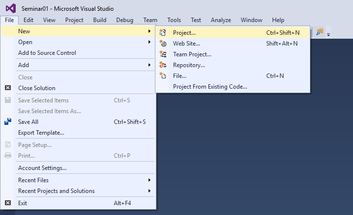
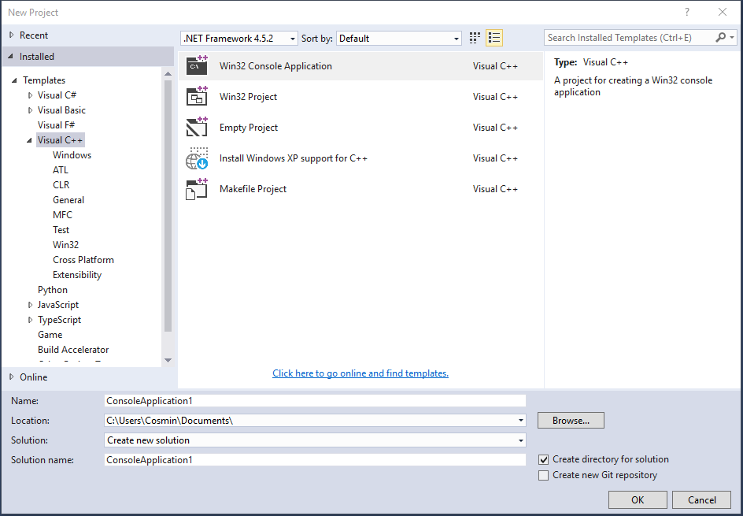
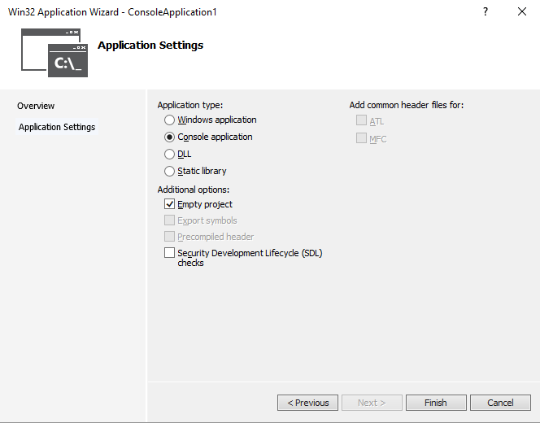
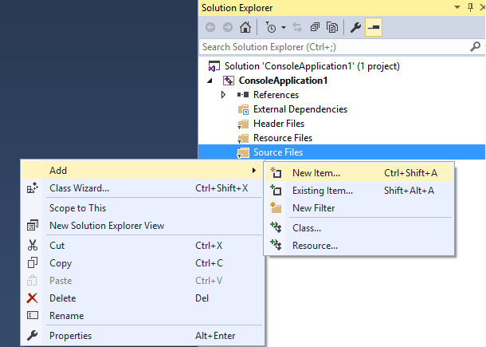
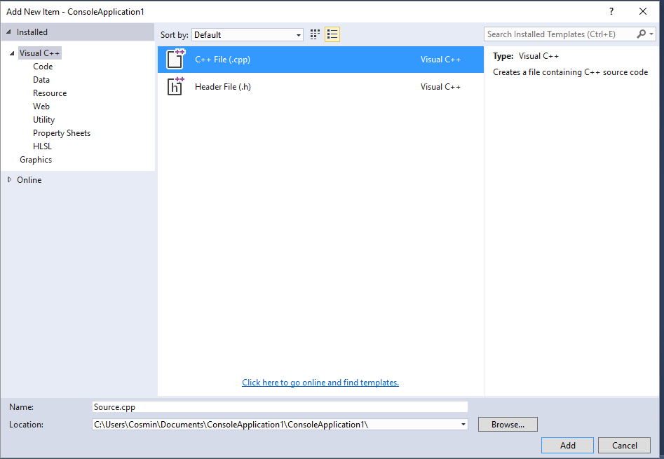

[Back to home](https://github.com/kenyz0r/Seminarii1035)

# Cum sa creezi un proiect in Visual Studio

# Pasul 1: Crearea proiectului
1. Navigheaza in meniul `File`;
2. Selecteaza optiunea `New`;
3. Din submeniul aparut se bifeaza `Project...`;

# Pasul 2: Tipul proiectului
1. In fereastra de configurare se alege din tab-ul `Installed`, limbajul tinta: `Visual C++`;
2. Se alege tipul proiectului: `Win32 Console Application` si se apasa butonul `OK`;

# Pasul 3: Setup-ul proiectului
1. La aparitia ferestrei de configurare se trece peste `Overview` prin apasarea butonului `Next >`;
2. In tab-ul `Application Settings` se debifeaza `Precombiled headers` si `Security Development Lifecycle (SDL) checks` din categoria `Additional options`;
3. Se bifeaza `Empty project` din categoria `Additional options`, dupa care se apasa butonul `Finish`;

### NOTE: ESTE FOARTE IMPORTANT SA SE EXECUTE A DOUA INSTRUCTIUNE

# Pasul 4: Adaugarea fisierelor in proiect

1. In `Solution Explorer` se selecteaza proiectul creat si se apasa CLICK DREAPTA pe folderul `Sources`;
2. Din meniul aparut se alege `Add`;
3. La aparitia submeniului se selecteaza varianta `New Item...`;

# Pasul 5: Fisiere sursa .cpp

1. Fiti siguri ca in meniul din stanga limbajul selectat este `Visual C++`;
2. In subcategoria `Code` se selecteaza optiunea `C++ File (.cpp)`, dupa care se apasa butonul `Add`;

