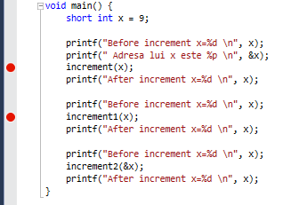

[Back to home](https://github.com/kenyz0r/Seminarii1035)

# Cum sa faci debug in Visual Studio?

# Pasul 1: Adaugarea unui breakpoint
1. Pentru inserarea unui breakpoint se apasa `CLICK STANGA` in dreptul instructiunii la care se doreste intreruperea executiei programului.
2. O alta modalitate de a adauga un breakpoint este prin selectarea instructiunii la care se doreste intreruperea executiei programului prin `CLICK DREAPTA`, dupa care se alege optiunea `Breakpoint` -> `Insert Breakpoint`

# Pasul 2: Pornirea in mod debug
1. Navigheaza in meniul `Debug`;
2. Se alege optiunea `Start Debugging`;

# Pasul 3: 