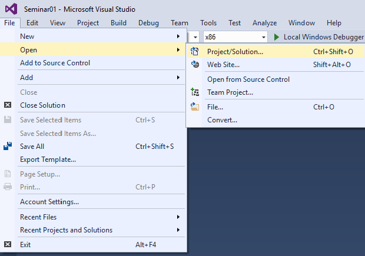
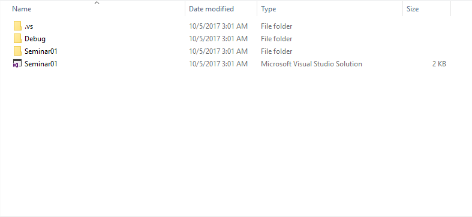
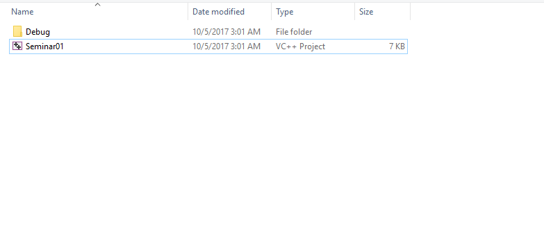

[Back to home](https://github.com/kenyz0r/Seminarii1035)

# Cum sa deschizi un proiect existent?

# Pas1: Deschiderea proiectului
1. Navigheaza in meniul `File`;
2. Selecteaza optiunea `Open`;
3. Din submeniul aparut se bifeaza `Project/Solution...`;

# Pas2: Alege locatia proiectului
1. Se deschide directorul proiectului;
2. Se selecteaza fisierul de tip `Microsoft Visual Studio Solution` sau `VC++ Project`;

 